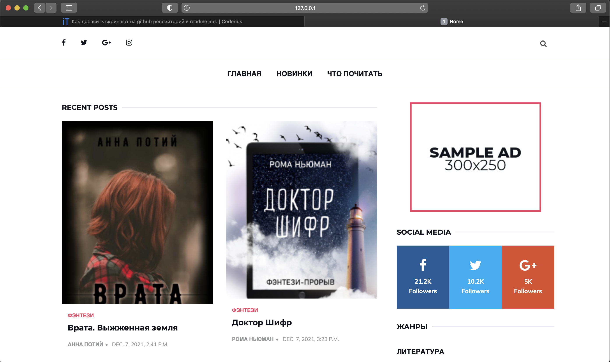
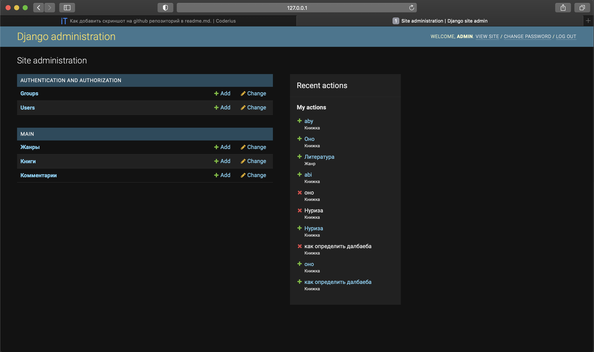
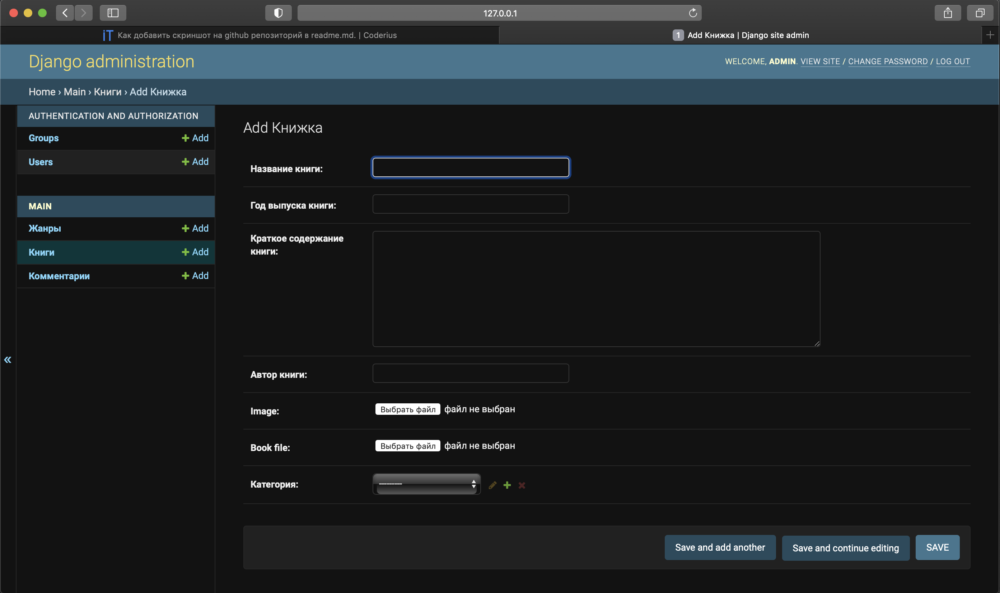

# task2_django
# Cайт для книг

---
Для начало создайте на рабочем столе папку, можете назвать его как угодно

Далее откройте терминал, перейдите на эту папку и введите в терминале:
```
git clone https://github.com/abdurazzak1200/task2_django/tree/master
```
Эта команда скачает template в вашу созданную папку

Далее мы активируем виртуальное окружение:
```
python3 -m venv env
source env/bin/activate
```

Скачаем django 3.2.9(версия обязательно должна быть 3.2.9)
```
pip3 install django==3.2.9
```

Заходим в папку mysite/ и активируем наш локальный сервер:
```
cd mysite/
python3 manage.py runserver
```


Далее заходите в браузер и введите: [127.0.0.1:8000](127.0.0.1:8000).



Можете ввести [127.0.0.1:8000/admin](127.0.0.1:8000/admin) и вы попадете в админ панель где вы можете добавлять
и редактировать книги, добавлять новые жанры и тд.


>На странице <главная> будет отображаться книги в порядке старые к новому
> 
>На странице <Новинки> будет отображаться книги в порядке новые к старому
> 
>На странице <Что почитать?> будет отображаться книги в ранодомном порядке каждый раз


Для добавления книг заходим в админ панель [127.0.0.1:8000/admin](127.0.0.1:8000/admin), заходим
в раздел книги потом "Добавить"


Заполняем все поля и сохраняем)

#На этом все!#


